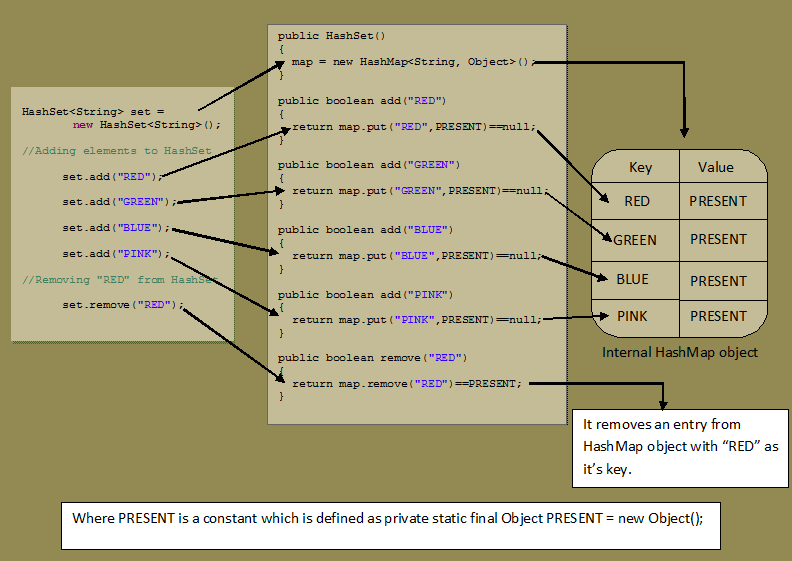

From [HashSet internal working](https://javaconceptoftheday.com/how-hashset-works-internally-in-java/#:~:text=HashSet%20internally%20uses%20HashMap%20to,keys%20of%20this%20HashMap%20object.)

HashSet internally uses HashMap to store its elements. Whenever you create a HashSet object, 
one HashMap object associated with it is also created. This HashMap object is used to store the
elements you enter the HashSet. The elements you add into HashSet are stored as keys of this
HashMap object. The value associated with those keys will be a constant. In this post, we will 
see Java HashSet internal working with an example.

Every constructor of HashSet class internally creates one HashMap object. You can check this in the
source code of HashSet class. Below is some sample code of the constructors of HashSet class.

```java
private transient HashMap<E, Object> map;

public HashSet() {
    map = new HashMap<>();          
}

public HashSet(Collection<? extends E> c) {
    map = new HashMap<>(Math.max((int) (c.size() / .75f) + 1, 16));     
    addAll(c);
}

public HashSet(int initialCapacity, float loadFactor) {
    map = new HashMap<>(initialCapacity, loadFactor);        
}

public HashSet(int initialCapacity) {
    map = new HashMap<>(initialCapacity);          
}
```
You can notice that each and every constructor internally creates one new `HashMap` object.

Whenever you insert an element into HashSet using add() method, it actually creates an entry in 
the internally backing HashMap object with element you have specified as it’s key and constant 
called *PRESENT* as its value. This *PRESENT* is defined in the HashSet class as below.
```java
// Dummy value to associate with an Object in the backing Map
private static final Object PRESENT = new Object();
```
Let’s have a look at `add()` method of HashSet class.
```java
public boolean add(E e) {
    return map.put(e, PRESENT)==null;
}
```
You can notice that, `add()` method of HashSet class internally calls `put()` method of backing HashMap
object by passing the element you have specified as a key and constant *PRESENT* as its value.

*remove()* method also works in the same manner.
```java
public boolean remove(Object o) {
    return map.remove(o)==PRESENT;
}
```
Let’s see one example of HashSet and how it maintains HashMap internally.
```java
public class HashSetExample {
    public static void main(String[] args) {
        //Creating One HashSet object
        HashSet<String> set = new HashSet<String>();
        //Adding elements to HashSet
        set.add("RED");
        set.add("GREEN");
        set.add("BLUE");
        set.add("PINK");
        //Removing "RED" from HashSet
        set.remove("RED");
    }
}
```
See the below picture how above program works internally. You can observe that internal HashMap object
contains elements of HashSet as keys and constant *PRESENT* as their value.



In the same manner, all methods of HashSet class process internally backing HashMap object to get the
desired result. If you know how HashMap works, it will be easy for you to understand how HashSet works.
You go through the source code of HashSet class once, you will get a clear picture about how HashSet 
works internally in Java.
