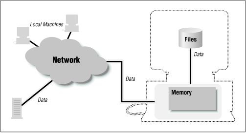

Discussions of Java’s security model often center around the idea of a sandbox model. The idea behind this model is that when you allow a program 
to be hosted on your computer, you want to provide an environment where the program can play (i.e., run), but you want to confine the program’s 
play area within certain bounds. You may decide to give the program certain toys to play with (i.e., you may decide to let it have access to certain 
system resources), but in general, you want to make sure that the program is confined to its sandbox.

This analogy works better when you consider it from the view of a close relative rather than from the view of a parent. If you’re a parent, you probably
consider the purpose of a sandbox to be to provide a safe environment for your child to play in. When my niece Rachel visits me, however, I consider the
purpose of a sandbox not (only) to be to protect her, but also to protect my grandmother’s china from her. I love my niece, but I can’t give her leave to
run through my house; I enjoy running the latest cool applet on the Internet, but I can’t give it leave to run through my filesystem.

The Java sandbox is responsible for protecting a number of resources, and it does so at a number of levels. Consider the resources of a typical machine as 
shown in Figure 1.1. The user’s machine has access to many things:

_Figure 1-1. A machine has access to many resources_

- Internally, it has access to its local memory (the computer’s RAM).
- Externally, it has access to its filesystem and to other machines on the local network.
- For running applets, it also has access to a web server, which may be on its local (private) net, or may be on the Internet.
- Data flows through this entire model, from the user’s machine through the network and (possibly) to disk.

Each of these resources needs to be protected, and those protections form the basis of Java’s security model.

We can imagine a number of different-sized sandboxes in which a Java program might run:
- A sandbox in which the program has access to the CPU, the screen, keyboard, and mouse, and to its own memory. This is the minimal sandbox—it contains just enough
resources for a program to run.
- A sandbox in which the program has access to the CPU and its own memory as well as access to the web server from which it was loaded. This is often thought of as 
the default state for the sandbox.
- A sandbox in which the program has access to the CPU, its memory, its web server, and to a set of program-specific resources (local files, local machines, etc.).
A word-processing program, for example, might have access to the docs directory on the local filesystem, but not to any other files.
- An open sandbox, in which the program has access to whatever resources the host machine normally has access to.

The sandbox, then, is not a one-size-fits-all model. Expanding the boundaries of the sandbox is always based on the notion of trust: when my one-year-old niece comes to visit,
there’s very little in the sandbox for her to play with, but when my six-year-old godchild comes to visit, I trust that I might give her more things to play with. In the hands
of some visitors, a toy with small removable parts would be dangerous, but when I trust the recipient, it’s perfectly reasonable to include that item in the sandbox. And so it 
is with Java programs: in some cases, I might trust them to access my filesystem; in other cases, I might trust them to access only part of my filesystem; and in still other 
cases, I might not trust them to access my filesystem at all.

Source: https://www.oreilly.com/library/view/java-security/1565924037/ch01s02.html#SEC-CH-1-FIG-2
